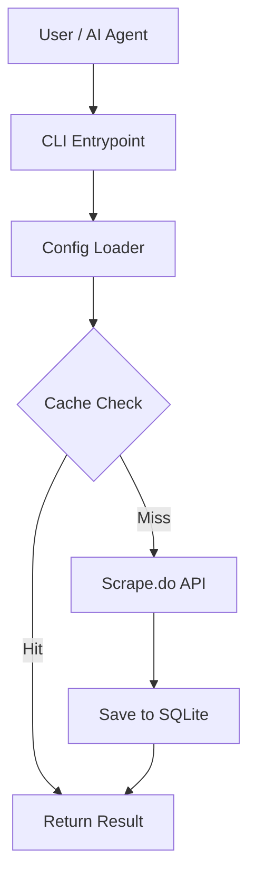
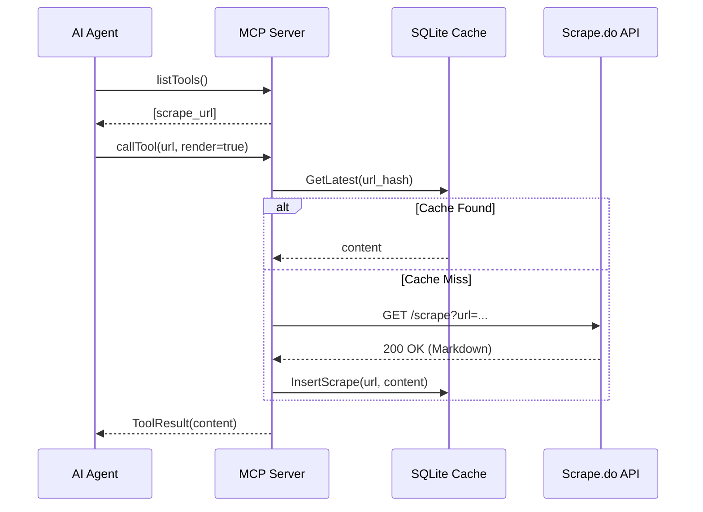

# 04 - Architecture & Design

## High-level Overview

`scrapedoctl` is built as a modular system that decouples the API client, the storage layer, and the communication interfaces (CLI/MCP).

### System Flow Diagram

## Model Context Protocol (MCP)

The MCP implementation allows any compatible client (like Claude Desktop or VS Code) to use `scrapedoctl` as a remote tool.

### Interaction Sequence

## Persistent Layer (SQLite)

The persistence layer uses a pure-Go SQLite implementation (`modernc.org/sqlite`) combined with `sqlc` for type-safe data access and `goose` for versioned migrations.

- **Request Normalization**: All requests are normalized (sorted params/headers) before hashing to ensure consistent cache lookup.
- **Auto-Cleanup**: The database self-manages disk space based on `keep_versions` and `max_size_mb` configuration settings.
