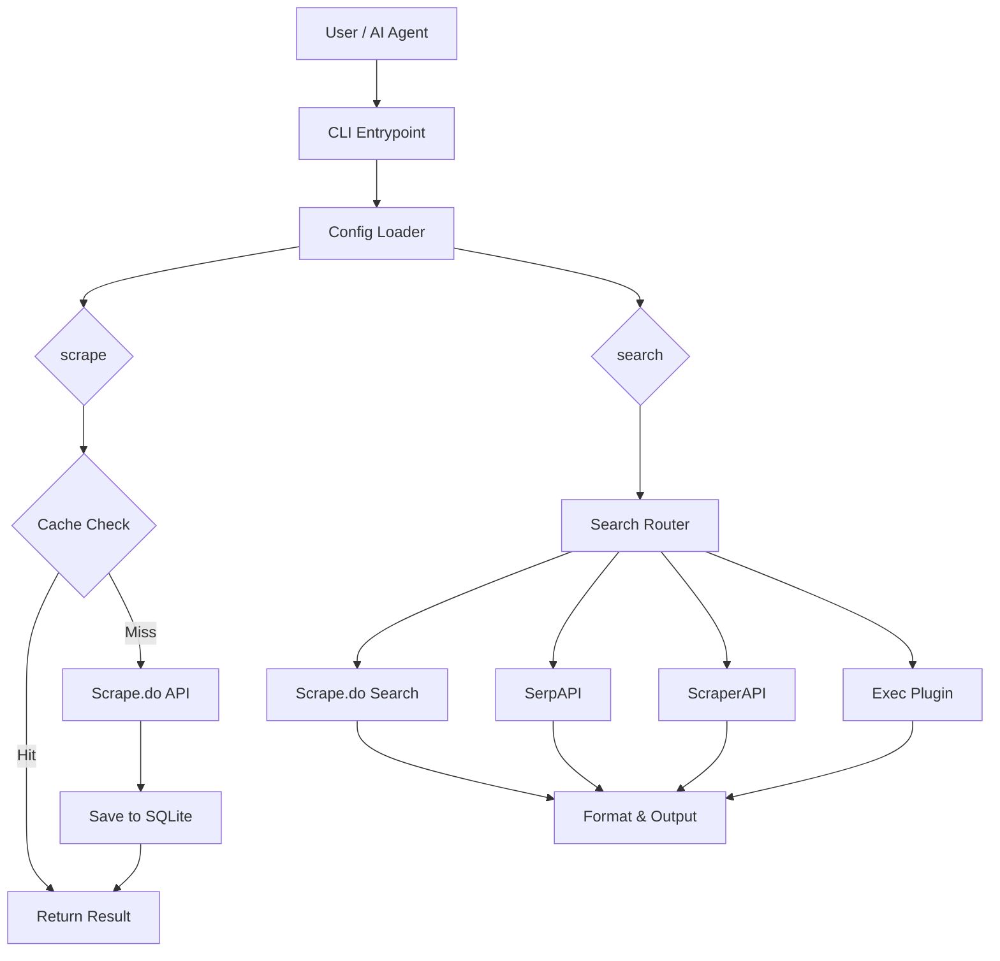
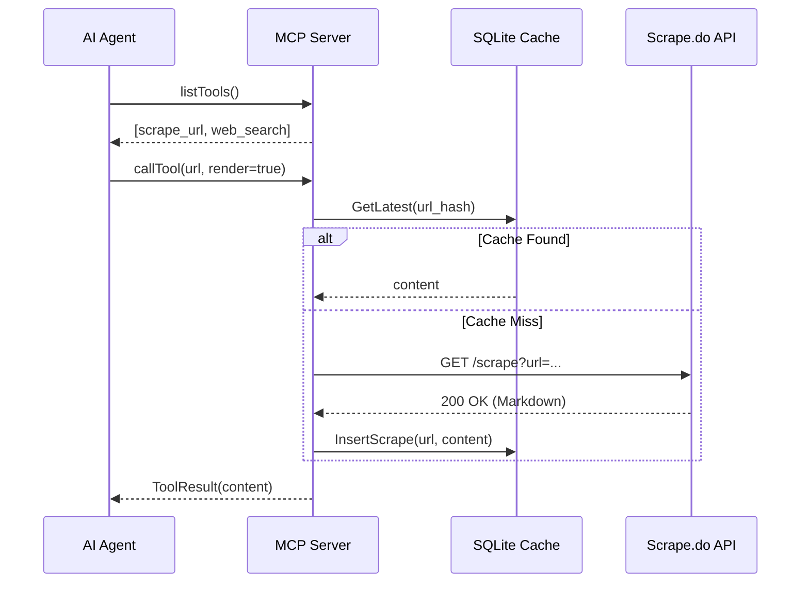
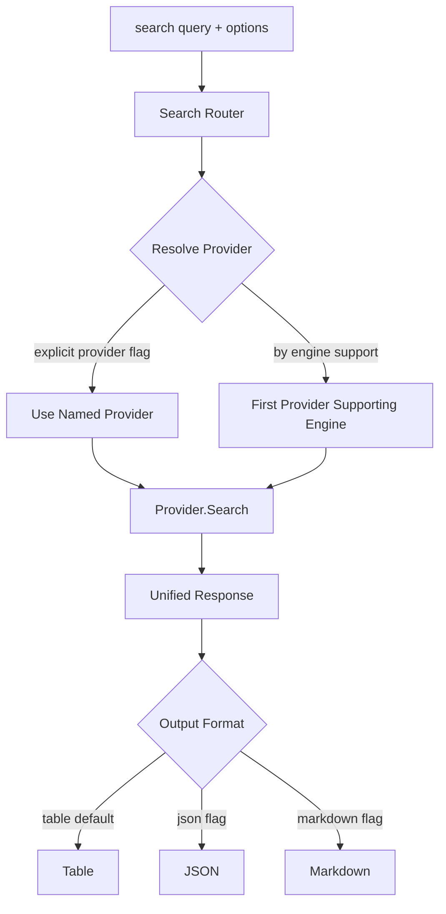

# 04 - Architecture & Design

## High-level Overview

`scrapedoctl` is built as a modular system that decouples the API client, the storage layer, and the communication interfaces (CLI/MCP).

### System Flow Diagram



## Model Context Protocol (MCP)

The MCP implementation allows any compatible client (like Claude Desktop or VS Code) to use `scrapedoctl` as a remote tool.

### Interaction Sequence



## Persistent Layer (SQLite)

The persistence layer uses a pure-Go SQLite implementation (`modernc.org/sqlite`) combined with `sqlc` for type-safe data access and `goose` for versioned migrations.

- **Request Normalization**: All requests are normalized (sorted params/headers) before hashing to ensure consistent cache lookup.
- **Auto-Cleanup**: The database self-manages disk space based on `keep_versions` and `max_size_mb` configuration settings.

### Usage Tracking

Every search and scrape operation is recorded in the `usage_log` table for local analytics. The table schema:

| Column | Type | Description |
|--------|------|-------------|
| `id` | INTEGER | Auto-increment primary key |
| `timestamp` | DATETIME | When the request was made |
| `provider` | TEXT | Provider name (scrapedo, serpapi, scraperapi) |
| `engine` | TEXT | Search engine used (google, bing, etc.) |
| `action` | TEXT | Operation type (search, scrape) |
| `query` | TEXT | The search query or URL |
| `credits` | INTEGER | Credits consumed by the request |

This data powers the `usage` CLI command and the `show usage` REPL subcommand, providing breakdowns by provider, action, and time range.

## Search Provider Architecture

The search subsystem uses a **Router** pattern to dispatch queries to the best available provider based on engine support and explicit provider selection.

### Provider Resolution



### Built-in Providers

| Provider | Engines | API Endpoint | Auth |
|----------|---------|-------------|------|
| Scrape.do | Google | `/plugin/google/search` | `global.token` (existing) |
| ScraperAPI | Google | `api.scraperapi.com/structured/google/search` | `[providers.scraperapi].token` |
| SerpAPI | Google, Bing, Yandex, DuckDuckGo, Baidu, Yahoo, Naver | `serpapi.com/search` | `[providers.serpapi].token` |

### Exec Plugin Protocol

Custom search providers are implemented as external executables. The plugin communicates via a JSON protocol over stdin/stdout:

1. `scrapedoctl` writes a JSON request to the plugin's stdin containing the query, engine, and options.
2. The plugin writes a JSON response to stdout with the search results.
3. The plugin exits with code 0 on success or non-zero on failure.

Configure an exec plugin in `conf.toml`:

```toml
[providers.my-plugin]
type    = "exec"
command = "/path/to/my-search-plugin"
engines = ["google", "custom-engine"]
```

### MCP Search Tool

The `web_search` MCP tool exposes the search subsystem to AI agents. When a search router is configured (at least one provider is available), the MCP server registers the `web_search` tool alongside `scrape_url`. Agents can call it with a query and optional engine parameter. If no search providers are configured, the tool is not registered.

```
Agent -> callTool("web_search", {query: "golang testing", engine: "google"})
Server -> Router.Resolve("google") -> Provider.Search(...)
Server -> Agent: ToolResult (markdown-formatted search results)
```

## CI/CD Pipeline

The project uses a modern CI/CD setup:

- **golangci-lint v2.11.3** -- comprehensive Go linting with SARIF output uploaded to GitHub Code Scanning.
- **govulncheck** -- Go vulnerability database checking on every CI run.
- **CodeQL** -- GitHub's semantic code analysis for security vulnerabilities.
- **UPX binary compression** -- release binaries are compressed with UPX for smaller downloads.
- **SARIF uploads** -- lint and security findings are uploaded as SARIF for unified GitHub Security tab integration.
