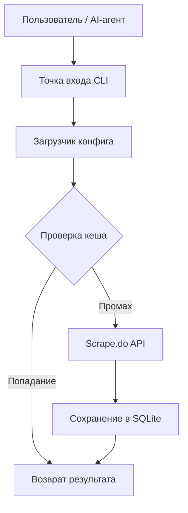
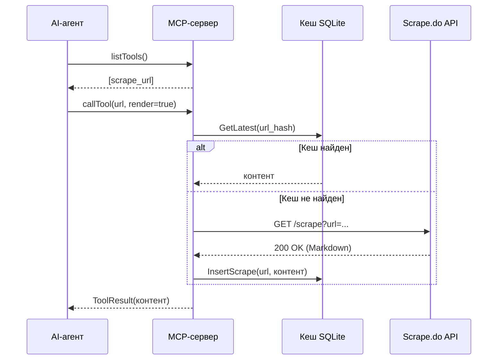

# 04 - Архитектура и дизайн

## Обзор системы

`scrapedoctl` построен как модульная система, разделяющая API-клиент, слой хранения и интерфейсы взаимодействия (CLI/MCP).

### Схема работы

## Model Context Protocol (MCP)

Реализация MCP позволяет любому совместимому клиенту (например, Claude Desktop или VS Code) использовать `scrapedoctl` как удаленный инструмент.

### Последовательность взаимодействия

## Слой хранения (SQLite)

Персистентный слой использует pure-Go реализацию SQLite (`modernc.org/sqlite`) в сочетании с `sqlc` для типобезопасного доступа к данным и `goose` для управления версиями миграций.

- **Нормализация запросов**: Все запросы нормализуются (сортировка параметров/заголовков) перед хешированием для обеспечения точности попадания в кеш.
- **Авто-очистка**: База данных самостоятельно управляет дисковым пространством на основе параметров конфигурации `keep_versions` и `max_size_mb`.
