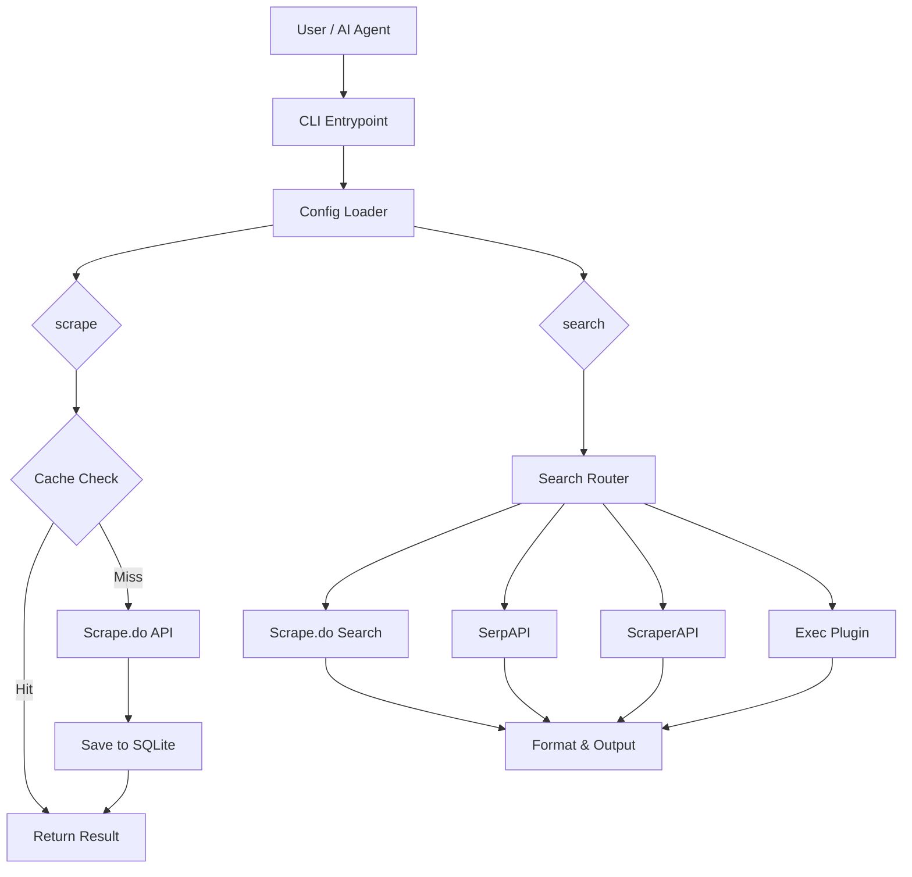
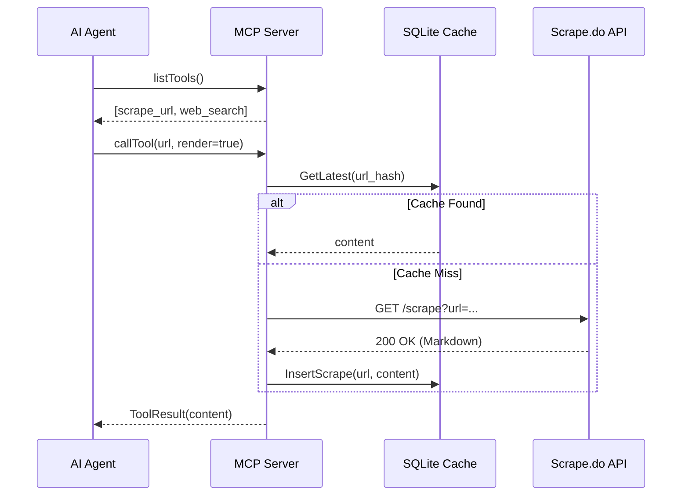
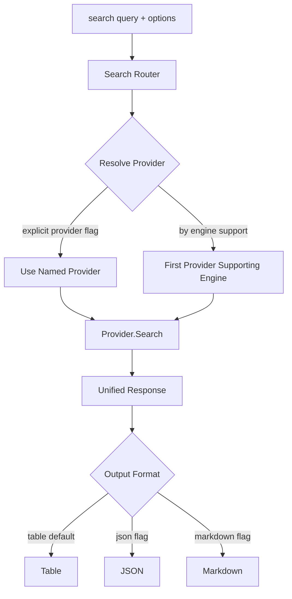

# 04 - Архитектура и дизайн

## Обзор системы

`scrapedoctl` построен как модульная система, разделяющая API-клиент, слой хранения и интерфейсы взаимодействия (CLI/MCP).

### Схема работы



## Model Context Protocol (MCP)

Реализация MCP позволяет любому совместимому клиенту (например, Claude Desktop или VS Code) использовать `scrapedoctl` как удалённый инструмент.

### Последовательность взаимодействия



## Слой хранения (SQLite)

Персистентный слой использует pure-Go реализацию SQLite (`modernc.org/sqlite`) в сочетании с `sqlc` для типобезопасного доступа к данным и `goose` для управления версиями миграций.

- **Нормализация запросов**: Все запросы нормализуются (сортировка параметров/заголовков) перед хешированием для обеспечения точности попадания в кэш.
- **Авто-очистка**: База данных самостоятельно управляет дисковым пространством на основе параметров конфигурации `keep_versions` и `max_size_mb`.

## Архитектура провайдеров поиска

Подсистема поиска использует паттерн **Router** для маршрутизации запросов к наиболее подходящему провайдеру на основе поддержки движков и явного выбора провайдера.

### Разрешение провайдера



### Встроенные провайдеры

| Провайдер | Движки | Аутентификация |
|-----------|--------|----------------|
| Scrape.do | Google | `global.token` (существующий) |
| ScraperAPI | Google | `[providers.scraperapi].token` |
| SerpAPI | Google, Bing, Yandex, DuckDuckGo, Baidu, Yahoo, Naver | `[providers.serpapi].token` |

### Протокол Exec-плагинов

Пользовательские провайдеры поиска реализуются как внешние исполняемые файлы. Плагин взаимодействует через JSON-протокол по stdin/stdout:

1. `scrapedoctl` записывает JSON-запрос в stdin плагина, содержащий поисковый запрос, движок и опции.
2. Плагин записывает JSON-ответ в stdout с результатами поиска.
3. Плагин завершается с кодом 0 в случае успеха или ненулевым кодом при ошибке.

Настройка exec-плагина в `conf.toml`:

```toml
[providers.my-plugin]
type    = "exec"
command = "/path/to/my-search-plugin"
engines = ["google", "custom-engine"]
```

### MCP-инструмент поиска

MCP-инструмент `web_search` предоставляет подсистему поиска AI-агентам. Когда настроен роутер поиска (доступен хотя бы один провайдер), MCP-сервер регистрирует инструмент `web_search` наряду с `scrape_url`. Агенты могут вызвать его с запросом и необязательным параметром движка. Если провайдеры поиска не настроены, инструмент не регистрируется.

```
Agent -> callTool("web_search", {query: "golang testing", engine: "google"})
Server -> Router.Resolve("google") -> Provider.Search(...)
Server -> Agent: ToolResult (markdown-formatted search results)
```

## CI/CD Pipeline

Проект использует современную CI/CD-конфигурацию:

- **golangci-lint v2.11.3** — комплексный линтинг Go с выводом в формате SARIF для загрузки в GitHub Code Scanning.
- **govulncheck** — проверка по базе уязвимостей Go при каждом запуске CI.
- **CodeQL** — семантический анализ кода GitHub для обнаружения уязвимостей безопасности.
- **UPX-сжатие бинарников** — релизные бинарники сжимаются с помощью UPX для уменьшения размера загрузки.
- **SARIF-загрузки** — результаты линтинга и анализа безопасности загружаются в формате SARIF для единой интеграции с вкладкой GitHub Security.
